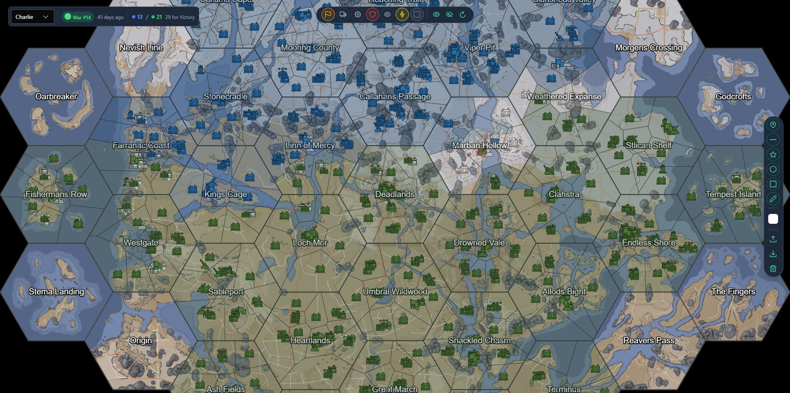

# Interactive Foxhole Map

A comprehensive interactive map for [Foxhole](https://www.foxholegame.com/) using OpenLayers and the Official Foxhole API for live data.

Deployed [here](https://foxhole-map-pcayj.ondigitalocean.app/) for now.

## Features

### 🗺️ **Map & Data**
- **Full map visualization** with minimal performance issues (hopefully)
- **Multi-shard support** - Select between Able, Baker, or Charlie shards
- **Live data integration** - Real-time updates from Official Foxhole API
- **Victory point tracking** - Shows current VP counts and requirements for victory
- **Complete structure catalog** - All in-game structures including bases, resource fields, factories, and more
- **Drawing tools** - Create custom markers and annotations on the map

## What does it look like?



## Keyboard Shortcuts

| Key | Action |
|-----|--------|
| `?` (Shift+/) | Show keyboard shortcuts |
| `R` | Reset map layers to defaults |
| `1-7` | Toggle layer groups (Overview, Logistics, Production, Defense, Intelligence, Heavy Weapons, Hex Sectors) |

## Development

### Prerequisites
- Node.js 18+
- Angular CLI 19+

### Getting Started
```bash
# Install dependencies
npm install

# Start development server
npm start

# Build for production
npm run build
# Outputs at ./dist

```

### Project Structure
```
src/
├── app/
│   ├── map/                    # Main map component
│   ├── drawing-toolbar/        # Drawing tools UI
│   ├── layer-groups-toolbar/   # Layer management UI
│   ├── hotkey-display/         # Keyboard shortcuts display
│   └── map-info/              # War info and VP display
├── services/
│   ├── war-api.service.ts      # API integration with caching
│   ├── drawing.service.ts      # Drawing functionality
│   ├── hotkey.service.ts       # Keyboard shortcuts
│   └── layer-groups.service.ts # Layer management
├── layers/                     # OpenLayers layer services
├── config/                     # Configuration files
└── assets/                     # Static assets and icons
```

## Contributing

1. Fork the repository
2. Create a feature branch (`git checkout -b feature/amazing-feature`)
3. Commit your changes (`git commit -m 'Add amazing feature'`)
4. Push to the branch (`git push origin feature/amazing-feature`)
5. Open a Pull Request

## Acknowledgments

- [Foxhole](https://www.foxholegame.com/) by Siege Camp, icons, assets, and the game
- [OpenLayers](https://openlayers.org/) for the mapping library
- [Angular](https://angular.io/) for the framework
- [PrimeNG](https://primeng.org/) for UI components
