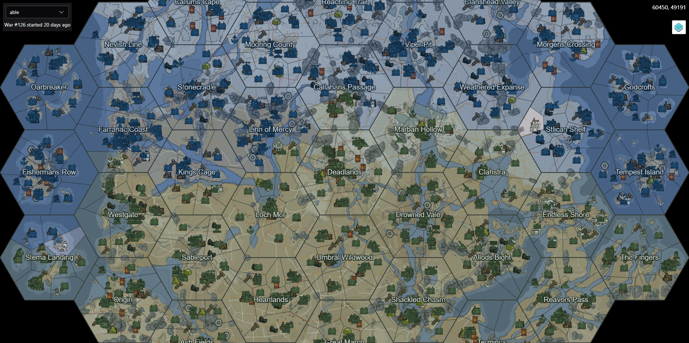

# Interactive Foxhole Map

A simple interactive map for [Foxhole](https://www.foxholegame.com/) using OpenLayers and the Official Foxhole API for live data.

Deployed [here](https://foxhole-map-pcayj.ondigitalocean.app/) for now.

## Features

- Whole map can be viewed with (hopefully) minimal performance issues
- Select any Shard (Able, Baker or Charlie)
- See all in-game structures including bases, resource fields, factories, and more
- Automatically refreshes showing changes as they happen

## What does it look like?

